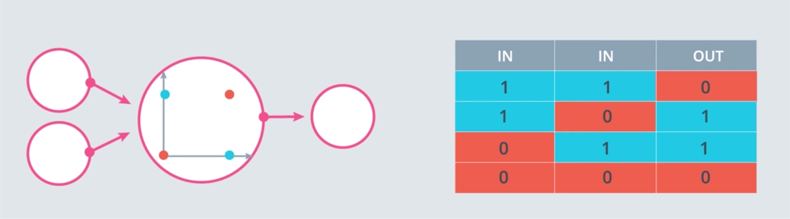
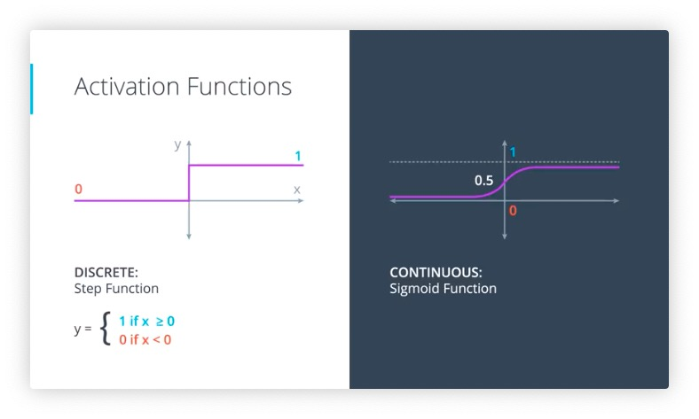
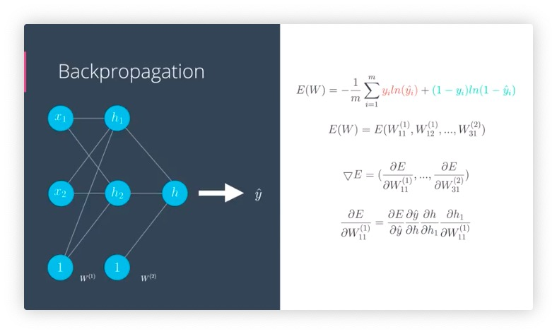

#### 6. perceptrons
N-1 dimensional hyperplane in N dimensional space: 
```
Wx + b = 0
W: weights
b: bias
```
Prediction: y hat (1 if Wx + b > 0, 0 if Wx + b < 0)


two ways to represent perceptrons:
- bias in the input node
- bias inside the node


#### 8. Perceptrons as Logical Operators:
and

or

not

xor


A: AND, B: OR, C: NOT.


#### 09. Perceptron Tricks
Q: why using the coordinate numbers to modify coefficients of the perceptron?


#### 10. Perceptron Algorithm
don't know why they choose that value but using the sign of coordinate number to do the extraction is very important, which guarantee the line will move "closer" regardless of the sign of the coordinate and coefficients.


`perceptron.py`
```python
import numpy as np
# Setting the random seed, feel free to change it and see different solutions.
np.random.seed(42)

def stepFunction(t):
    if t >= 0:
        return 1
    return 0

def prediction(X, W, b):
    return stepFunction((np.matmul(X,W)+b)[0])

# TODO: Fill in the code below to implement the perceptron trick.
# The function should receive as inputs the data X, the labels y,
# the weights W (as an array), and the bias b,
# update the weights and bias W, b, according to the perceptron algorithm,
# and return W and b.

def perceptronStep(X, y, W, b, learn_rate = 0.01):
    for i in range(len(X)):
        y_hat = prediction(X[i],W,b)
        if y[i]-y_hat == 1:
            W[0] += X[i][0]*learn_rate
            W[1] += X[i][1]*learn_rate
            b += learn_rate
        elif y[i]-y_hat == -1:
            W[0] -= X[i][0]*learn_rate
            W[1] -= X[i][1]*learn_rate
            b -= learn_rate
    return W, b

# the version that I wrote after reading the solution on 2019-01-21:
# def perceptronStep(X, y, W, b, learn_rate = 0.01):
#     for i in range(X.shape[0]):
#         if y[i] < prediction(X[i], W, b):
#             W[0] = W[0] - learn_rate * X[i][0]
#             W[1] = W[1] - learn_rate * X[i][1]
#             b = b - learn_rate
#         elif y[i] > prediction(X[i], W, b):
#             W[0] = W[0] + learn_rate * X[i][0]
#             W[1] = W[1] + learn_rate * X[i][1]
#             b = b + learn_rate
#     return W, b 

    
# This function runs the perceptron algorithm repeatedly on the dataset,
# and returns a few of the boundary lines obtained in the iterations,
# for plotting purposes.
# Feel free to play with the learning rate and the num_epochs,
# and see your results plotted below.
def trainPerceptronAlgorithm(X, y, learn_rate = 0.01, num_epochs = 25):
    x_min, x_max = min(X.T[0]), max(X.T[0])
    y_min, y_max = min(X.T[1]), max(X.T[1])
    W = np.array(np.random.rand(2,1))
    b = np.random.rand(1)[0] + x_max
    # These are the solution lines that get plotted below.
    boundary_lines = []
    for i in range(num_epochs):
        # In each epoch, we apply the perceptron step.
        W, b = perceptronStep(X, y, W, b, learn_rate)
        boundary_lines.append((-W[0]/W[1], -b/W[1]))
    return boundary_lines
```

#### 13. log-loss error function


the loss function needs to be continous and derivable, otherwise the algorithm won't know which direction to descend if the loss is discrete (the loss in every direction could be all the same)

#### 14. discrete vs continous
The sigmoid function is defined as sigmoid(x) = 1/(1+e-x)


prediction is a function of the distance of the point to the boundry


#### 15. Multi-Class Classification and softmax


sigmoid function is the same as softmax when n = 2 (why???)
```python
import numpy as np

# Write a function that takes as input a list of numbers, and returns
# the list of values given by the softmax function.
def softmax(L):
    return list(np.exp(L)/np.exp(L).sum())
```


#### 19. cross entropy 1
maxmize the product of probabilities that the model predicts the label of each point correctly, assuming we already know the class of each points\
=> maximize the sum of log of each probability\
=> minimize `cross entropy` -- negative of sum of log of each probability


#### 20. cross entropy 2
this is actually the `log-loss formula`:

`cross_entropy.py`
```python
import numpy as np

# Write a function that takes as input two lists Y, P,
# and returns the float corresponding to their cross-entropy.
def cross_entropy(Y, P):
    Y = np.float_(Y)
    P = np.float_(P)
    return -np.sum(Y * np.log(P) + (1 - Y) * np.log(1 - P))
```

21. multi-class cross entropy


22. logistic regression


23. gradient descent


The gradient is actually a scalar times the coordinates of the point! And what is the scalar? Nothing less than a multiple of the difference between the label and the prediction. 


思路疏理:
为了预测准确就要减少错误\
=> 最小化 loss function\
=> 对 loss function 求导, 得到 gradient descent 的方向就是 loss function 减少最快的方向\
=> 沿着 gradient descent 更新 perceptron 中的 weight 和 interception 的值\
=> loss function 又是什么呢? 用 cross entropy 定义的, 关于 prediction 的函数
=> prediction 又是什么呢? 由 perceptron 中的 weight 和 interception 算出来的, 并 通过 sigmoid 函数转换成了一个 属于 [0, 1] 的数字

25. [notebook](https://github.com/udacity/deep-learning-v2-pytorch/tree/master/intro-neural-networks/gradient-descent)

```python
# Activation (sigmoid) function
def sigmoid(x):
    return 1 / (1 + np.exp(-x))

# use np.dot() -- where I got my error
# Output (prediction) formula
def output_formula(features, weights, bias):
    return sigmoid(np.dot(features, weights) + bias)

# Error (log-loss) formula
def error_formula(y, output):
    return - y*np.log(output) - (1 - y) * np.log(1-output)

# Gradient descent step
def update_weights(x, y, weights, bias, learnrate):
    output = output_formula(x, weights, bias)
    d_error = y - output
    weights += learnrate * d_error * x
    bias += learnrate * d_error
    return weights, bias
```

27. 
perceptron:
if the point is correctly classified, then the point is 

gradient descent:
if the point is correctly classified then the point wants the line to go further away (so that the point can go deeper into the correct region)


28. (worth watching when trying to review it)


30. 
the curve consists of points that have the same probability of either being blue or red


31. 


don't forget sigmoid function


number of input nodes in input layers:
    dimension of the input space
number of output nodes:
    number of classes to be classified
number of layers:
    deep neural network, linear models combine to have non linear models, and they combine to create even more non-linear models


32. 


33. backpropagation

In a nutshell, backpropagation will consist of:

- Doing a feedforward operation.
- Comparing the output of the model with the desired output.
- Calculating the error.
- Running the feedforward operation backwards (backpropagation) to spread the error to each of the weights.
- Use this to update the weights, and get a better model.
- Continue this until we have a model that is good.




*note the input of the hidden layer are not `h1` and `h2`, but sigmoid of them*


34(?)
#### Activation (sigmoid) function
```python
# Activation (sigmoid) function
def sigmoid(x):
    return 1 / (1 + np.exp(-x))
def sigmoid_prime(x):
    return sigmoid(x) * (1-sigmoid(x))
def error_formula(y, output):
    return - y*np.log(output) - (1 - y) * np.log(1-output)
```

#### error term formula
```python
# TODO: Write the error term formula
def error_term_formula(x, y, output):
    return (y - output)*output*(1-output)

# return (y - output)*sigmoid_prime(x)
# is incorrect ...........
```

#### NN
```python
# Neural Network hyperparameters
epochs = 1000
learnrate = 0.5

# Training function
# Training function
def train_nn(features, targets, epochs, learnrate):
    
    # Use to same seed to make debugging easier
    np.random.seed(42)

    n_records, n_features = features.shape
    last_loss = None

    # Initialize weights
    weights = np.random.normal(scale=1 / n_features**.5, size=n_features)

    for e in range(epochs):
        del_w = np.zeros(weights.shape)
        for x, y in zip(features.values, targets):
            # Loop through all records, x is the input, y is the target

            # Activation of the output unit
            #   Notice we multiply the inputs and the weights here 
            #   rather than storing h as a separate variable 
            output = sigmoid(np.dot(x, weights))

            # The error, the target minus the network output
            error = error_formula(y, output)

            # The error term
            error_term = error_term_formula(x, y, output)

            # The gradient descent step, the error times the gradient times the inputs
            del_w += error_term * x

        # Update the weights here. The learning rate times the 
        # change in weights, divided by the number of records to average
        weights += learnrate * del_w / n_records

        # Printing out the mean square error on the training set
        if e % (epochs / 10) == 0:
            out = sigmoid(np.dot(features, weights))
            loss = np.mean((out - targets) ** 2)
            print("Epoch:", e)
            if last_loss and last_loss < loss:
                print("Train loss: ", loss, "  WARNING - Loss Increasing")
            else:
                print("Train loss: ", loss)
            last_loss = loss
            print("=========")
    print("Finished training!")
    return weights
    
weights = train_nn(features, targets, epochs, learnrate)
```


improvements on the [suggested answer](https://github.com/udacity/deep-learning-v2-pytorch/blob/master/intro-neural-networks/student-admissions/StudentAdmissionsSolutions.ipynb):\
Q1: TODO: One-hot encoding the rank
```python
one_hot_data = pd.get_dummies(data, columns=['rank'])
```

skewed data with different scales makes it hard for a neural network to handle. 

accuracy: percentage of the whole set that the prediction is correct

Questions:
1. what the heck is that error term and does that function in the code applies to nn with any number of hidden layers?
2. why letting us write `error_formula()` when it is not used in this function?
A: read carefully, it says 2 layer nerual network, only input and output layer, no hidden layer.

This is totally messed up, the error term provided in the answer assumes the error function to be MSE (`Ε = 0.5 * (y - y_hat)**2`) instead of cross entropy ... (also mentioned in [DL笔记：梯度下降 Gradient Descent](https://www.uegeek.com/171222DLN6-GradientDescent.html))
*(if derive from cross entropy, then the error term will only be y minus y_hat), at least that is the result that I got.*

the issue has been clarified in [[intro-neural-networks/student-admissions/StudentAdmissions] issues](https://github.com/udacity/deep-learning-v2-pytorch/issues/99#issue-389868051), what I want to say is, this question set is really messed up.

to sum up, [DL笔记：用 python 实现梯度下降的算法](https://www.uegeek.com/171226DLN7-GradientDescentinPython.html) provided a clearer code.

\- 
Helpful links:

[Study-09-MachineLearning-[Supervised Learning]](https://github.com/mainkoon81/Study-09-MachineLearning-B)
[Deep learning series 1: Intro to deep learning](https://medium.com/intro-to-artificial-intelligence/deep-learning-series-1-intro-to-deep-learning-abb1780ee20)

37. testing
if a simple model can do a good job whereas a complex model can only do slightly better, then we choose the simple one

38. overfitting and underfitting
generalize poorly


we'll err on the side of an overly complicated model and apply certain technique to prevent overfitting on it


39. early stopping

pass the goldilocks point: stop generalizing the model and just memorize the training data


40. regularization


the model on the right is too certain, gives less room for applying a gradient decent: the derivatives are mostly close to 0 and very large when close to the middle of the curve
the point that is incorrectly classified in the model on the right will generate larger erro is hard to be corrected by the model


punish large coefficients


42. turn off the dominating part and let the rest of the nerual network train


44. random restart


45. vanishing gradient

probability of a bunch of small sigmoid functions will be even smaller


46. other activation functions


47. 
split the data in batches, take the first batch of data and run them through the nerual network, calculate the error and its gradient and back-propagate to update the weights, and take the other batches then repeat the same thing

it's much better to take several slightly inaccurate steps than a good one


48. general rule of thumb: if your model is not working, decrease the learning rate

good learning rates are those that decrease as model is getting closer to solution


